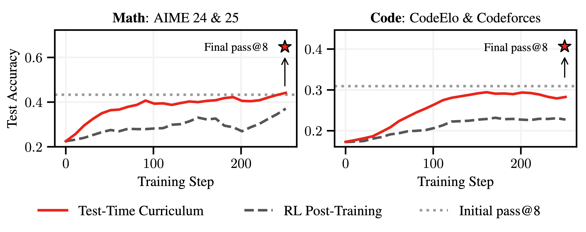
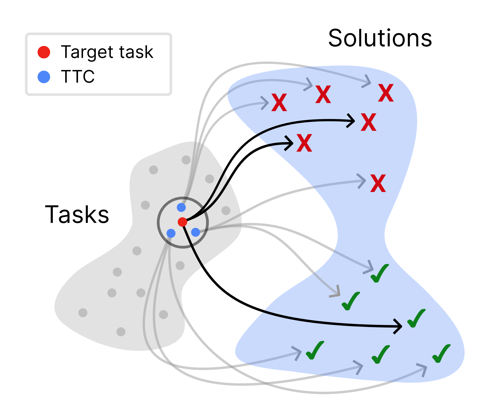
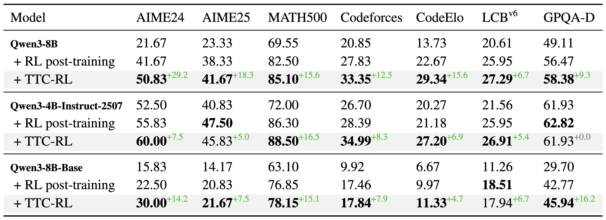
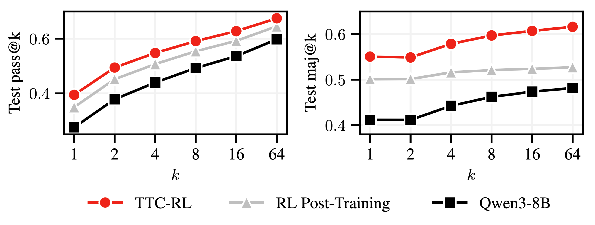
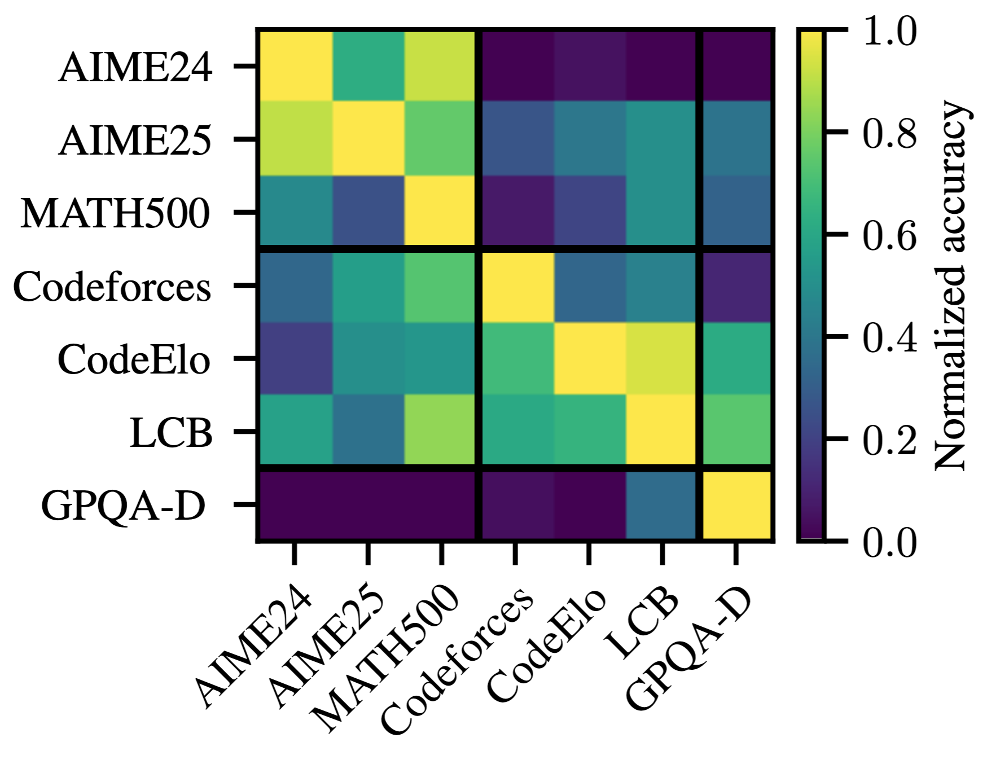
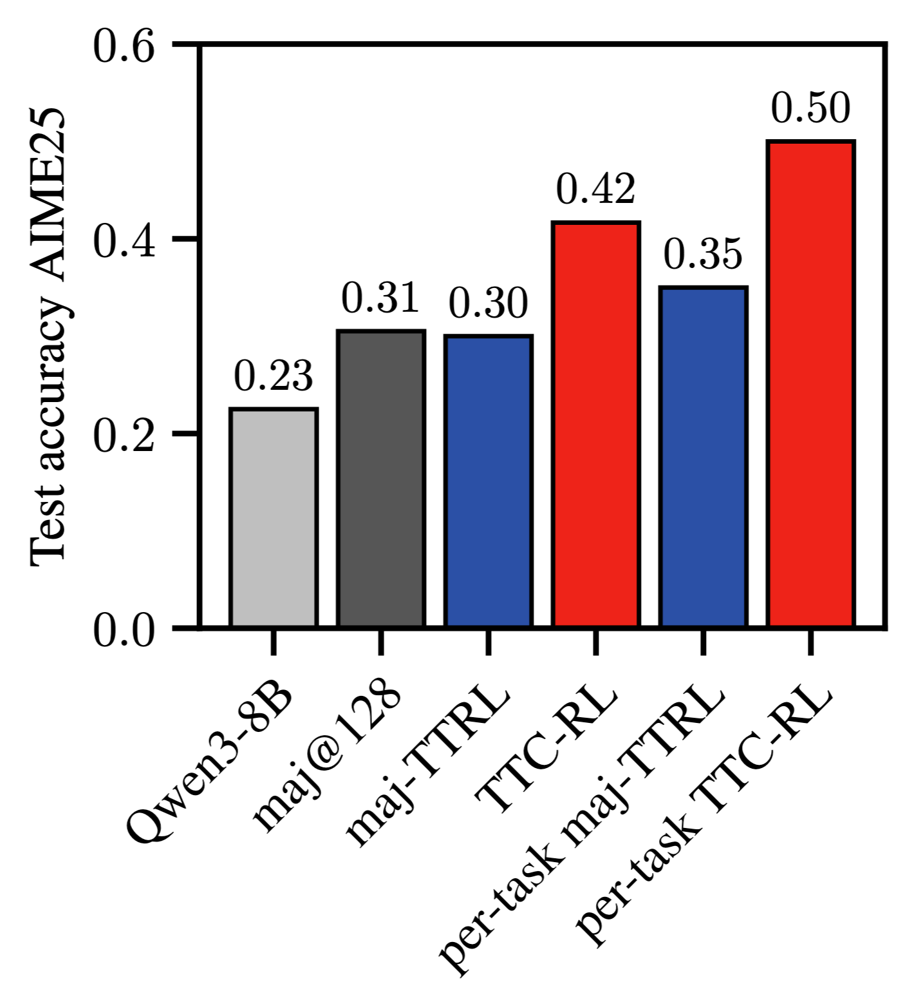

<div align="center">

# Learning on the Job: Test-Time Curricula for Targeted RL

[](https://arxiv.org/abs/XXX) [](https://huggingface.co/papers/XXX)  [](https://github.com/jonhue/ttc) [](https://huggingface.co/collections/lasgroup/test-time-curricula-for-targeted-rl-68def9ada11db5d6122006f5) [](https://huggingface.co/datasets/lasgroup/verifiable-corpus) [](https://wandb.ai/jonhue/TTCs/workspace?nw=scwg4fkbwr)

</div>

<div align="center" style="font-family: Arial, sans-serif;">
  <p>
    <a href="#-introduction" style="text-decoration: none; font-weight: bold;">📖 Introduction</a> •
    <a href="#-main-results" style="text-decoration: none; font-weight: bold;">📊 Main Results</a>
  </p>
  <p>
    <a href="#-getting-started" style="text-decoration: none; font-weight: bold;">🚀 Getting Started</a> •
    <a href="#-contact" style="text-decoration: none; font-weight: bold;">📨 Contact</a> •
    <a href="#-citation" style="text-decoration: none; font-weight: bold;">🎈 Citation</a>
  </p>
</div>

## 📖 Introduction

**We study how large language models (LLMs) can continually improve at reasoning on their target tasks at test-time.**
We propose an agent that assembles a task-specific curriculum, called _test-time curriculum_ (TTC-RL), and applies reinforcement learning to continue training the model for its target task.
Our experiments demonstrate that reinforcement learning on a test-time curriculum consistently improves the model on its target tasks, across a variety of evaluations and models.

<p align="center">
   
   
</p>

TTC-RL performs targeted practice on similar problems to the target task at test-time. The agent is given a target task (red) and self-curates a curriculum of related tasks (blue). It then explores solution strategies on this curriculum, reinforcing successful approaches. This experience enables the agent to more effectively solve the original, more difficult target task.

<p align="center">
</p>

## 📊 Main Results

On challenging math and coding benchmarks, TTC-RL improves the `pass@1` of `Qwen3-8B` by approximately 1.8x on AIME25 and 2.1x on CodeElo.

<p align="center">
   
</p>

Moreover, we find that TTC-RL significantly raises the performance ceiling compared to the initial model, increasing `pass@8` on AIME25 from 40% to 62% and on CodeElo from 28% to 43%.
TTC-RL substantially improves the performance of majority voting, and notably improves initial `pass@1` well beyond the `maj@64` after general-purpose RL post-training.

<p align="center">
   
</p>

### Other noteworthy findings

* TTC-RL specializes models effectively to their target tasks
* TTC-RL can specialize models to individual tasks, e.g., individual math questions from AIME25

<p align="center">
   
   
</p>

## 🚀 Getting Started

The following details how to reproduce our results with TTC-RL.

### Installation & Setup

Clone the repository and add to PYTHONPATH:
```
git clone --recurse-submodules https://github.com/jonhue/ttc
export PYTHONPATH=.../ttc:$PYTHONPATH
```
Install additional libraries and the modified version of verl:
```
pip install -r requirements.txt
pip install -e TTRL/verl/.;
pip install -e activeft/.;
```

This repository builds on the [Test-Time Reinforcement Learning (TTRL)](https://github.com/PRIME-RL/TTRL) and the [Volcano Engine Reinforcement Learning (verl)](https://github.com/volcengine/verl) libraries. Please refer to the documentation of these libraries for basic functionality and setup.

### 📚 Corpus Creation

To generate the corpus, run:
```
python data/train/create_dataset.py
```

### 📂 Dataset Preprocessing

Use the generate_verl_data.sh script to create datasets for training:
```
DATA_PATH=...
bash generate_verl_data.sh Qwen/Qwen3-8B lasgroup/verifiable-corpus math-ai/aime25 $DATA_PATH false 500000 true false false true
```

### 🎯 Training

To start TTC-RL training on the generated dataset:
```
bash training/verl_training.sh Qwen/Qwen3-8B lasgroup_verifiable-corpus_math-ai_aime25_500000
```

## 📨 Contact

Jonas Hübotter: jonas.huebotter@inf.ethz.ch

## 🎈 Citation
If you find this work helpful, please cite us.

```bibtex
@article{hubotter2025learning,
	title        = {Learning on the Job: Test-Time Curricula for Targeted Reinforcement Learning},
	author       = {H{\"u}botter, Jonas and Diaz-Bone, Leander and Hakimi, Ido and Krause, Andreas and Hardt, Moritz},
	year         = 2025,
	journal      = {arXiv preprint arXiv:XXX}
}

@inproceedings{hubotter2024efficiently,
	title        = {Efficiently Learning at Test-Time: Active Fine-Tuning of LLMs},
	author       = {H{\"u}botter, Jonas and Bongni, Sascha and Hakimi, Ido and Krause, Andreas},
	year         = 2025,
	booktitle    = {ICLR}
}
```
